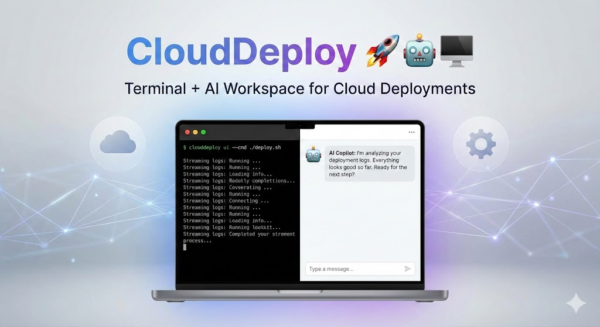
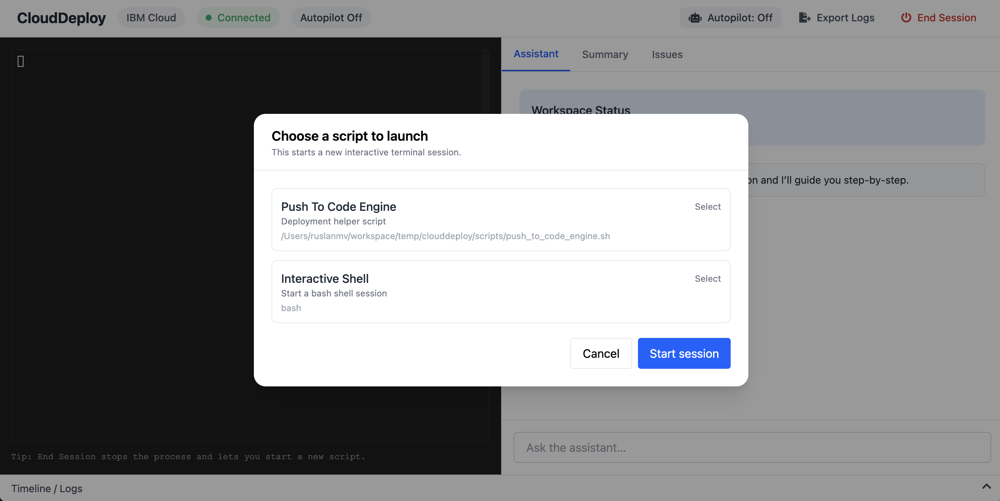
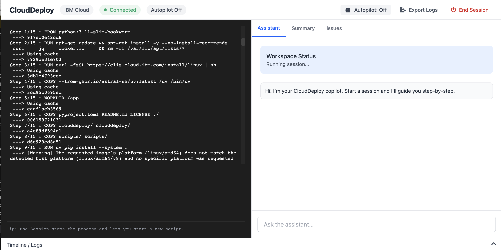
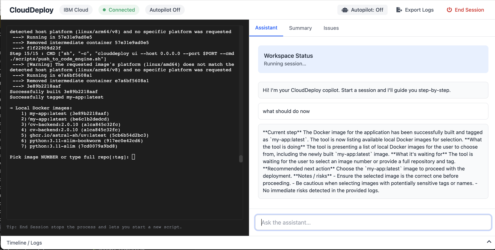
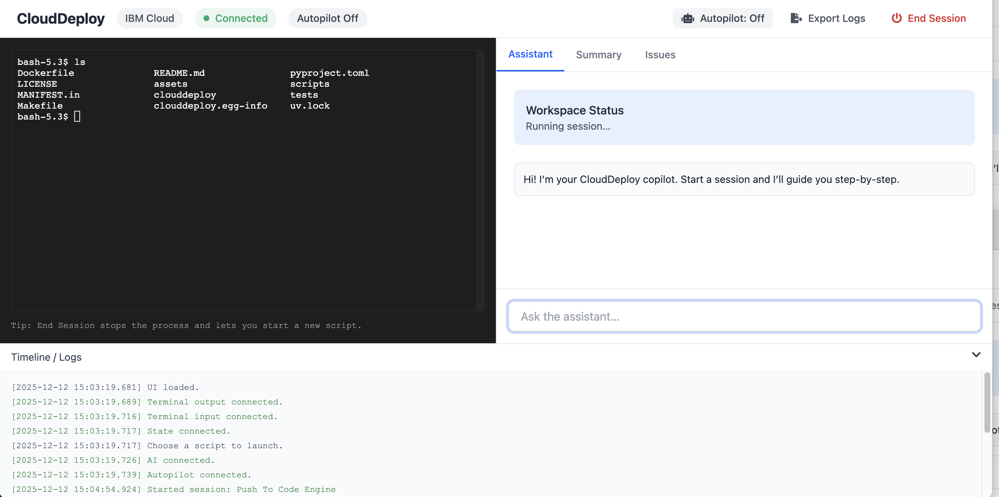
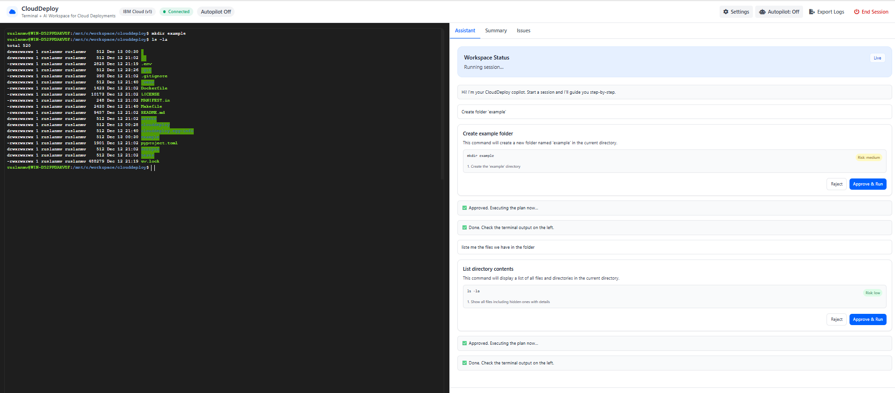

# CloudDeploy 🚀🤖🖥️  
**Terminal + AI Workspace for Cloud Deployments (Local-First, Enterprise-Ready)**




If you've ever lost hours to "works on my machine" deployments, interactive CLIs, missing env vars, or confusing cloud logs — **CloudDeploy** is for you.

CloudDeploy is a **local workspace** that runs your **real interactive deployment CLI** in a browser (left panel), while an **AI deployment copilot** (right panel) explains what's happening, flags issues early, and suggests next actions — with **intelligent autopilot modes** that can both drive wizard prompts and execute approved AI plans under guardrails.

⭐ If CloudDeploy saves you even one deployment incident, please **star the repo**.

---

## ✨ Highlights

- 🖥️ **Real Terminal in the Browser** (PTY-backed, not fake logs)
- 🔁 **Live Streaming Output** + prompt detection
- 🤖 **AI Copilot** reads **sanitized** terminal tail + state
- 🎯 **AI Plan Execution** - AI suggests commands, you approve, they execute in terminal
- 🛡️ **Dual Autopilot Modes**:
  - **Wizard Mode:** Safely drives interactive prompts (y/n, numeric choices)
  - **AI Auto-Execution:** Auto-approves and runs AI-generated plans (dev mode)
- 🧰 **MCP Tool Server** (same tool layer powers UI + agents)
- 🧾 **Audit-Friendly UX**: timeline, summary, issues, approval workflows
- 🔌 **Provider-Extensible** (prompt maps + automation modules)

---

## 🧠 What is CloudDeploy?

CloudDeploy combines three things into one workflow:

### 1) Web Workspace (Terminal + AI)
- Runs a real PTY-backed terminal session in your browser
- Streams logs live
- Detects wizard prompts & steps automatically
- Shows status / summary / issues in a clean enterprise UI

### 2) AI Copilot for Deployments
- Reads **sanitized** terminal output (redaction by default)
- Explains current step in plain language
- **NEW:** Creates executable plans for user requests (create folders, list files, check status)
- Suggests the safest next action
- Helps troubleshoot failures with actionable hints

### 3) MCP Server (Tooling Interface)
- Exposes the deployment session as tools (stdio MCP)
- Enables external agents/orchestrators to observe, reason, and optionally automate
- **Same tool layer powers UI Autopilot** — no duplicated automation systems

> **v1 focus:** IBM Cloud Container Registry + Code Engine deployment wizards  
> **v2 new:** AI-powered terminal operations (file management, inspections, deployments)  
> **Roadmap:** multi-cloud providers, reusable prompt maps, enterprise policy packs, audit trails

---

## 🏢 Why teams adopt CloudDeploy (Enterprise mindset)

- 👩‍💻 **Zero-to-hero onboarding:** consistent wizard experience across engineers
- 🔥 **Incident reduction:** step detection + AI explanations reduce "unknown unknowns"
- 🧾 **Audit-friendly:** timeline, step snapshots, and policy-guarded actions with approval workflows
- 🛡️ **Safe automation:** autopilot answers wizard prompts OR auto-executes AI plans (configurable)
- 🎯 **AI-assisted operations:** create folders, inspect files, check deployments via natural language
- 🧩 **Extensible:** add providers via prompt maps + automation modules

---

## 📦 Install

```bash
pip install clouddeploy
```

CloudDeploy runs locally and uses **your system tools** (Docker/CLIs/etc).
No vendor lock-in: the AI provider is configurable.

---

## ✅ Prerequisites

### System Requirements

* Python **3.11+**
* macOS / Linux recommended (PTY-based runner)
* Windows: supported via **WSL2** (recommended)

### IBM Cloud Requirements (v1)

Ensure these are available in your `PATH`:

* `ibmcloud` CLI
* `docker`
* `jq`

Permissions needed:

* Container Registry access
* Code Engine project access
* IAM API key creation (optional; only if using auto-key creation flow)

---

## 🚀 Quick Start

### 1) Run the Web Workspace (Terminal + AI)

Launches a browser workspace where:

* Left = real CLI wizard running in a PTY
* Right = AI assistant (Assistant / Summary / Issues)
* Top = status + **Autopilot toggle**

```bash
clouddeploy ui --cmd ./scripts/push_to_code_engine.sh --host 127.0.0.1 --port 8787
```

Open:

* [http://127.0.0.1:8787](http://127.0.0.1:8787)

> Tip: You can run **any** interactive CLI wizard — detection is pluggable.

## Choose Script


## Building and Deployment Scripts



## AI Assistant 


## Interactive Shells


---

## 🎯 NEW: AI Plan Execution (Interactive Commands)

CloudDeploy now features **AI-powered terminal operations** with a Plan → Approve → Execute workflow.

### How It Works

1. **Ask the AI** to perform a task (in natural language)
2. **AI creates a plan** with specific commands, reasons, and risk levels
3. **Review the plan** in an approval card (see what will run)
4. **Approve or reject** - commands only execute after your approval
5. **Watch execution** in the left terminal (you'll see commands being typed)

### 📋 Example: Creating Folders and Files

**You ask:**
```
"Create a folder called 'example' and put a README.md file inside"
```

**AI responds with plan card:**

```
┌─────────────────────────────────────────────────────────┐
│ Create folder structure                                 │
├─────────────────────────────────────────────────────────┤
│ 1. mkdir example                                        │
│    Why: Create the 'example' directory                 │
│    Risk: Medium                                         │
│                                                         │
│ 2. touch example/README.md                             │
│    Why: Create README file inside example folder       │
│    Risk: Medium                                         │
├─────────────────────────────────────────────────────────┤
│            [Reject]      [Approve & Run ✓]              │
└─────────────────────────────────────────────────────────┘
```

**You click "Approve & Run"**

**Left terminal shows:**
```bash
$ mkdir example
$ touch example/README.md
$ 
```

**Result:** ✅ Folder created with README file inside




### 🎮 More Examples

#### List Files
```
You: "List all files in this directory"

AI Plan:
┌────────────────────────────────┐
│ List directory contents        │
├────────────────────────────────┤
│ ls -la                         │
│ Why: Show all files + details  │
│ Risk: Low                      │
└────────────────────────────────┘
```

#### Check Docker Status
```
You: "Check if Docker is running"

AI Plan:
┌────────────────────────────────┐
│ Check Docker status            │
├────────────────────────────────┤
│ docker ps                      │
│ Why: List running containers   │
│ Risk: Low                      │
└────────────────────────────────┘
```

#### Copy Files
```
You: "Copy config.json to config.backup.json"

AI Plan:
┌────────────────────────────────┐
│ Backup configuration file      │
├────────────────────────────────┤
│ cp config.json config.backup.json │
│ Why: Create backup copy        │
│ Risk: Medium                   │
└────────────────────────────────┘
```

### 🛡️ Safety Features

**3-Layer Validation:**
1. **AI suggests** only safe, relevant commands
2. **Server validates** against allowlist/blocklist before execution
3. **User approves** manually (or autopilot auto-approves in dev mode)

**Command Policy:**
- ✅ **Allowed:** `mkdir`, `touch`, `ls`, `cp`, `mv`, `cat`, `grep`, `docker`, `kubectl`, `git`, etc.
- ⚠️ **Restricted:** `rm` (only safe patterns like `rm file.txt`, blocks `rm -rf /`)
- ❌ **Blocked:** `sudo`, `shutdown`, `chmod 777`, destructive wildcards

**Risk Labeling:**
- 🟢 **Low:** Read-only operations (`ls`, `cat`, `docker ps`)
- 🟡 **Medium:** Write operations (`mkdir`, `touch`, `cp`, `npm install`)
- 🔴 **High:** Destructive/deployment operations (`rm`, `kubectl delete`, `git push`)

---

## 🤖 Autopilot (Two Modes)

CloudDeploy includes an **Autopilot** toggle with two distinct behaviors:

### Mode 1: Wizard Automation (Default Autopilot)

When running **deployment scripts/wizards**, autopilot:

* Prefers defaults (**ENTER**)
* Uses safe yes/no answers (`Y` / `n`)
* Selects numeric choices when clearly detected
* **Stops on errors** (does not guess destructive fixes)

This is the original autopilot behavior for script wizards.

### Mode 2: AI Plan Auto-Execution (NEW) 🚀

When **autopilot is enabled** and you ask the AI to do something:

**Autopilot OFF (Manual Mode - Default):**
```
You: "Create folder 'test'"
AI: [Shows approval card]
You: [Must click "Approve & Run"]
Result: Commands execute after approval
```

**Autopilot ON (Auto Mode):**
```
You: "Create folder 'test'"
AI: 🤖 Autopilot Plan: Create folder
     1. mkdir test (medium)
     Auto-executing now…
Result: Commands execute IMMEDIATELY (no approval needed)
```

### 🎯 When to Use Each Mode

**Autopilot OFF (Recommended for Production):**
- ✅ Production deployments
- ✅ Sensitive operations
- ✅ Learning mode (review what AI suggests)
- ✅ Manual oversight required

**Autopilot ON (Great for Development):**
- ✅ Development/testing environments
- ✅ Fast iteration workflows
- ✅ Trusted operations (file management, inspections)
- ✅ Demo scenarios

### 🛡️ Safety Guardrails (Both Modes)

Autopilot and AI plan execution are filtered through the same policy engine:

* Blocks dangerous patterns (`rm -rf /`, shutdown, destructive payloads)
* Command allowlist (only approved commands can run)
* Risk assessment (labels each command low/medium/high)
* Maximum 15 steps per plan
* Server-side validation (double-checks every command)

**Even in autopilot mode, blocked commands will fail.**

---

## 🧭 UX: Ending / Switching Sessions (Best Practice)

CloudDeploy follows an enterprise-safe pattern:

* Clicking **End Session** opens a **Switch Session** picker
* **Cancel** returns to the current session (nothing is stopped)
* The current session is stopped **only when you click "Start session"** for a new script
  (commit point prevents accidental termination)

This prevents "oops I clicked End Session" incidents and supports rapid restarts.

---

## 🎨 Complete Workflow Example

### Scenario: Setting Up a New Project Structure

**Step 1: Start Interactive Shell**
```bash
clouddeploy ui --cmd bash --host 127.0.0.1 --port 8787
```

**Step 2: Ask AI to Set Up Project**
```
You: "Create a project structure with folders: src, tests, docs, and a README.md"

AI: 🎯 Create project structure

    1. mkdir src (medium)
    2. mkdir tests (medium)  
    3. mkdir docs (medium)
    4. touch README.md (medium)
    
    [Reject] [Approve & Run]
```

**Step 3: Approve and Watch Execution**
```bash
$ mkdir src
$ mkdir tests
$ mkdir docs
$ touch README.md
$ 
```

**Step 4: Verify Structure**
```
You: "List all folders and files"

AI: 📋 List directory contents

    1. ls -la (low)
    
    [Approve & Run]
```

**Terminal Output:**
```bash
$ ls -la
drwxr-xr-x  2 user  staff   64 Dec 13 10:30 src
drwxr-xr-x  2 user  staff   64 Dec 13 10:30 tests
drwxr-xr-x  2 user  staff   64 Dec 13 10:30 docs
-rw-r--r--  1 user  staff    0 Dec 13 10:30 README.md
```

**Step 5: Enable Autopilot for Faster Workflow**
```
[Click Autopilot button to enable]

You: "Create a test file in the tests folder"

AI: 🤖 Autopilot Plan: Create test file
    1. touch tests/test_main.py (medium)
    Auto-executing now…

$ touch tests/test_main.py
✅ Done. Check the terminal output on the left.
```

---

## 🔧 Run as an MCP Server (stdio)

CloudDeploy can run as a **tool server** for external agents:

```bash
clouddeploy mcp --cmd ./scripts/push_to_code_engine.sh
```

Example tool call (read sanitized tail output):

```bash
echo '{"id":"1","tool":"cli.read","args":{"tail_chars":1200,"redact":true}}' \
  | clouddeploy mcp --cmd ./scripts/push_to_code_engine.sh
```

This enables:

* agent-driven observability
* enterprise orchestration integrations
* automated pipelines with human approvals

---

## 🔌 LLM Provider Configuration

CloudDeploy uses a provider abstraction (`clouddeploy/llm/llm_provider.py`) and supports:

* **watsonx.ai** (default, recommended)
* OpenAI
* Claude (Anthropic)
* Ollama (local)

### ✅ watsonx.ai (Recommended)

```bash
export GITPILOT_PROVIDER=watsonx
export WATSONX_API_KEY="YOUR_KEY"
export WATSONX_PROJECT_ID="YOUR_PROJECT_ID"

# Optional overrides
export WATSONX_BASE_URL="https://us-south.ml.cloud.ibm.com"
export GITPILOT_WATSONX_MODEL="ibm/granite-3-8b-instruct"
```

### OpenAI

```bash
export GITPILOT_PROVIDER=openai
export OPENAI_API_KEY="YOUR_KEY"
export GITPILOT_OPENAI_MODEL="gpt-4o-mini"

# Optional
export OPENAI_BASE_URL="https://api.openai.com"
```

### Claude (Anthropic)

```bash
export GITPILOT_PROVIDER=claude
export ANTHROPIC_API_KEY="YOUR_KEY"
export GITPILOT_CLAUDE_MODEL="claude-sonnet-4-5"

# Optional
export ANTHROPIC_BASE_URL="https://api.anthropic.com"
```

### Ollama (Local)

```bash
export GITPILOT_PROVIDER=ollama
export OLLAMA_BASE_URL="http://localhost:11434"
export GITPILOT_OLLAMA_MODEL="llama3"
```

---

## 🔐 Security & Compliance Notes (Important)

CloudDeploy is designed for enterprise usage:

### 🧼 Redaction by default

Terminal logs sent to the AI are sanitized (`clouddeploy/redact.py`):

* masks API keys, tokens, passwords
* masks Bearer tokens
* can optionally redact `.env` values while keeping keys

### 🛡️ Policy-guarded automation

All automation is gated (`clouddeploy/mcp/policy.py`):

* blocks destructive patterns
* strict mode restricts to safe wizard responses
* AI plan commands validated by allowlist/blocklist
* manual approval required by default (autopilot is opt-in)

### 🏠 Local-first

You run CloudDeploy locally; it uses the same credentials/tools you already use:

* no credential harvesting
* no remote terminal execution layer required
* commands execute in your local PTY (you see them typing)

> Best practice: use least-privilege IAM keys and managed secret stores.

---

## 🧱 Project Structure

```text
clouddeploy/
  server.py                # FastAPI app + WebSockets + session/plan endpoints
  web/
    index.html             # UI shell (no bundler)
    app.js                 # UI logic (xterm + websockets + plan approval + autopilot)
    styles.css             # UI styles
  mcp/
    tools.py               # ToolRegistry interface (CLI read/send/state)
    policy.py              # Input guardrails + command validation
  llm/
    llm_provider.py        # Provider abstraction
    prompts.py             # System + status + plan protocol prompts
  ibm/
    automation.py          # IBM-specific autopilot heuristics
scripts/
  push_to_code_engine.sh   # Example deployment script
```

---

## 🧪 Development (uv-only workflows)

CloudDeploy uses **uv** for fast, reproducible installs.

```bash
make sync
make run-ui CMD=./scripts/push_to_code_engine.sh
make test
make lint
```

---

## 🧪 Testing the New AI Features

### Test 1: File Management

```bash
# Start interactive shell
clouddeploy ui --cmd bash

# In AI chat:
"Create a folder called 'demo' with files: app.py, config.json, README.md"

# Expected: AI creates 4-step plan
# You approve, watch execution in left terminal
```

### Test 2: Docker Operations

```bash
# In AI chat:
"Check what Docker containers are running"

# Expected: AI suggests "docker ps"
# You approve, see container list in terminal
```

### Test 3: Autopilot Mode

```bash
# Enable autopilot (click button)

# In AI chat:
"Create folders: src, tests, docs"

# Expected: AI plan auto-executes immediately
# Terminal shows all 3 mkdir commands running
```

### Test 4: Safety Validation

```bash
# In AI chat:
"Delete all files recursively"

# Expected: AI might suggest "rm -rf ."
# Validation rejects (blocked by policy)
# Error shown: "Command contains blocked keyword"
```

---

## 📊 Allowed Commands Reference

### Read-Only (Risk: Low)
- File inspection: `ls`, `cat`, `head`, `tail`, `grep`, `find`, `tree`
- System info: `pwd`, `whoami`, `date`, `uname`, `env`
- Docker: `docker ps`, `docker images`, `docker logs`
- Kubernetes: `kubectl get`, `kubectl describe`, `kubectl logs`
- Git: `git status`, `git log`, `git diff`

### Write Operations (Risk: Medium)
- Create: `mkdir`, `touch`
- Copy/Move: `cp`, `mv`
- Package managers: `npm install`, `pip install`
- Build: `docker build`, `make`

### Deployment (Risk: High when applicable)
- Kubernetes: `kubectl apply`, `kubectl delete`
- Helm: `helm install`, `helm upgrade`
- Git: `git push`, `git commit`

### Blocked Commands
- ❌ `sudo` (privilege escalation)
- ❌ `rm -rf /` (destructive wildcards)
- ❌ `shutdown`, `reboot` (system control)
- ❌ `chmod 777` (unsafe permissions)

---

## 🧩 Contributing

We welcome PRs for:

* new cloud provider prompt maps
* improved step detection rules
* better policy packs
* UI enhancements
* wizard regression samples
* **NEW:** Additional allowed commands (with safety validation)
* **NEW:** AI plan templates for common workflows

Guidelines:

* keep automation conservative (safe-by-default)
* never leak secrets; respect redaction
* prefer deterministic state detection over heuristics
* validate all AI-suggested commands server-side
* provide clear risk labels (low/medium/high)

---

## 🆘 Support / Community

If you hit a tricky deployment edge-case:

* capture sanitized logs (Export Logs button)
* open an issue with the step + error section
* or propose a new prompt map rule

For AI plan execution issues:

* share the plan JSON that was generated
* indicate which command failed validation
* suggest allowlist additions (with safety justification)

⭐ If CloudDeploy helps your team ship faster, please **star the repo** — it drives adoption and accelerates multi-cloud support.

---

## 📜 License

Apache 2.0 — see `LICENSE`.

---

## 🎉 What's New in v2

### AI Plan Execution
- ✅ Natural language to terminal commands
- ✅ Plan → Approve → Execute workflow
- ✅ Real-time execution in left terminal
- ✅ Risk-labeled command steps
- ✅ Multi-step plan support (up to 15 steps)

### Enhanced Autopilot
- ✅ Dual-mode operation (wizard + AI plans)
- ✅ Auto-execution mode for development
- ✅ Visual feedback for mode switching
- ✅ Safety validation in both modes

### Security Improvements
- ✅ Command allowlist/blocklist
- ✅ Safe `rm` pattern validation
- ✅ Server-side command validation
- ✅ Execution locks (prevent conflicts)
- ✅ Audit trail (timeline logging)

### UX Enhancements
- ✅ Approval cards with risk indicators
- ✅ Compact plan summaries in autopilot mode
- ✅ Clear mode indicators (manual vs auto)
- ✅ Execution status in UI

---

**Made with ❤️ for DevOps teams tired of deployment incidents**